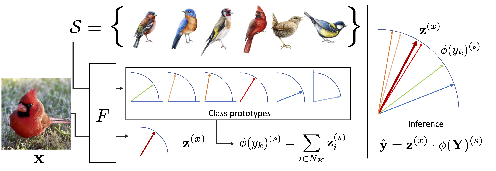

# Recognition of Unseen Bird Species by Learning from Field Guides (WACV 2024)

Official impementation [arxiv](https://arxiv.org/abs/2206.01466v2)


We exploit field guides to learn bird species recognition, in particular zero-shot recognition of unseen species.



We introduce Bird Illustrations of the World dataset (**Billow**) as a side-information for Generalized Zero-shot Learning (GZSL) and use it in the bird-subsets of iNaturalist to test large-scale datasets. We test Billow with an encoded approach for comparison with existing literature and introduce Prototype Alignment (PA) to extract directly the image information and fine-tune the representations obtained with Billow.

## 1. GZSL Results on iNaturalist bird subsets

| Dataset | Spli  | Classes           | Train-samples  | Val -samples |
| --------| ----- |-------------:| -----:|-----:|
| iNat2017 | Seen     | 381 | 97,067 | 8,626 |
| iNat2017 | Unseen     | 514 | - | 11,073 |
| iNat2021 | Seen     | 749 | 211,027 | 7,490 |
| iNat2017 | Unseen     | 736 | - | 7,360 |


## 2. Encoded datasets

Download billow_codes and other types of side information from [here](https://drive.google.com/drive/folders/13GYqlIHENFMG0cX1P7PWzUJp-5LvkDAb?usp=share_link).
CUB200 can be downloaded [here](http://datasets.d2.mpi-inf.mpg.de/xian/xlsa17.zip).

### 2.1 Billow codes for CUB200-2011
The file `codes_billow.npz` contains the embedded classes for 196 classes from CUB200.

```
import numpy as np

a = np.load('codes_billow.npz')

classes = a['cls]
codes = a['tops']
```

`classes` is the same class index in the [proposed split](https://www.mpi-inf.mpg.de/departments/computer-vision-and-machine-learning/research/zero-shot-learning/zero-shot-learning-the-good-the-bad-and-the-ugly) for CUB200.


### 2.2. Billow codes
The file `billow_encoded/codes.h5` contains the embedded classes for all the billow classes. See an example of the dataloader class `H5Dataset_billow_codes` in `Baselines/tfvaegan/dataloader_billow.py`

`cls` is the same class index in the `species_list.csv`.

### 2.3. iNaturalist
Feature extraction from iNaturalist datasets can be done as follows:

`python extract_pretrained_features.py --model_name resnet101 --year 2021 --subset aves --root_dir PATH_ROOT`

PATH_root expects the following structure and uses webdatasets to avoid extracting the tar.gz files. Data can be downloaded directly from [https://github.com/visipedia/inat_comp](https://github.com/visipedia/inat_comp).

Split classes created with `inaturalist_splits.ipynb` can be downloaded [here](https://drive.google.com/drive/folders/13GYqlIHENFMG0cX1P7PWzUJp-5LvkDAb?usp=share_link):

```
iNaturalist
- 2017
|- train_val_images.tar.gz
|- train_val2017
 |- train2017.json
 |- val2017.json
|- zsl_splits
 |- seen_classes.txt
 |- unseen_1hop_classes.txt
 |- ...

- 2021
|- train.gar.gz
|- train.json
|- train_mini.tar.gz
|- ...
|- zsl_splits
 |- ...
```


## 3. Baselines with Encoded datasets

We provide slight modifications of the original codes from [TFVAEGAN](https://github.com/akshitac8/tfvaegan), [CE-GZSL](https://github.com/Hanzy1996/CE-GZSL) and [LsrGAN](https://github.com/Maunil/LsrGAN) to work with CUB and different types of side-information, and iNaturalist2017 and iNaturalist2021 with side-information from Billow.
To train a model refer to `train_cub.sh` and `train_inat.sh` from each baseline.


## 4. Billow illustrations

Birds of the world is a project organized that can be fully accesed only with a paid suscription. Several free-previous accounts are available, for example for [European Bee-eater](https://birdsoftheworld.org/bow/species/eubeat1/cur/introduction), [Vermilion Flycatcher](https://birdsoftheworld.org/bow/species/verfly/cur/introduction).
We used a paid suscription to the Birds of the World project to obtain access to the illustrations listed in `download_list.csv` using `download_billow.py`.
If you access the illustrations, please be sure to comply with the license, terms of conditions set out by the Cornell Lab of Ornithology.


## 5. Dependencies
You can use environment.yml to re-create the environment with conda, or at least have:
- python 3.8
- pytorch 1.10.2
- torchvision=0.11.3
- pandas


